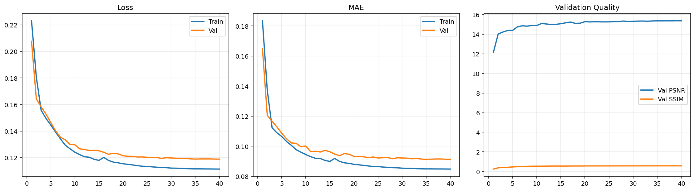
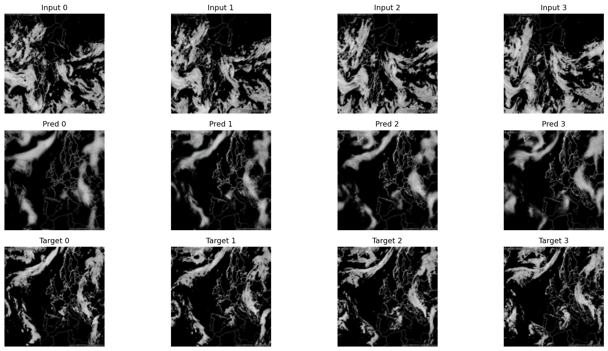

# Cloud Nowcasting ConvLSTM

A ConvLSTM-based deep learning pipeline for predicting cloud movement from ordered satellite image sequences. This project is a ground-up rewrite and upgrade of [Prediction-of-Cloud-Movement-fromSatellite-Imagery-using-DeepLearning](https://github.com/AdrianBildea/Prediction-of-Cloud-Movement-fromSatellite-Imagery-using-DeepLearning), trained on the same dataset with a significantly improved architecture, training pipeline, and evaluation methodology.

---

## Table of Contents

- [Overview](#overview)
- [Results](#results)
- [What Changed from v1](#what-changed-from-v1)
- [Architecture](#architecture)
- [Loss Function](#loss-function)
- [Project Structure](#project-structure)
- [Requirements](#requirements)
- [Installation](#installation)
- [Usage](#usage)
  - [Command-line](#command-line)
  - [Notebook](#notebook)
- [Configuration](#configuration)
- [Outputs](#outputs)
- [Dataset](#dataset)

---

## Overview

The pipeline accepts a directory of time-ordered images (satellite frames), builds sliding input/target windows of configurable length, and trains a stacked ConvLSTM network to predict the next frame at each time step. The full training loop includes mixed-precision (AMP), gradient clipping, cosine LR annealing, early stopping, and automatic checkpoint resumption.

---

## Results

Trained on 248 infrared satellite frames (January 2021) on an NVIDIA GeForce RTX 5090 Laptop GPU. Full training (40 epochs) completed in ~7.7 minutes.

| Metric | Test score |
|--------|-----------|
| Loss | 0.1002 |
| MAE | 0.0770 |
| PSNR | 16.60 dB |
| SSIM | 0.633 |

**Training curves** — Loss, MAE, and Validation PSNR/SSIM across 40 epochs:



**Predictions preview** — Input sequence (top), model predictions (middle), ground truth targets (bottom):



---

## What Changed from v1

The original project ([v1](https://github.com/AdrianBildea/Prediction-of-Cloud-Movement-fromSatellite-Imagery-using-DeepLearning)) established the core idea — ConvLSTM-based cloud frame prediction on infrared satellite imagery — and included useful traditional CV preprocessing stages (optical flow, SIFT). This version retains the dataset and the ConvLSTM premise but replaces or upgrades nearly every other component.

### Framework

| | v1 | v2 |
|---|---|---|
| Framework | TensorFlow / Keras | PyTorch (native) |
| Mixed precision | Not used | `torch.amp` AMP with GradScaler |
| Device handling | Default | Explicit CUDA setup, cuDNN benchmark, TF32 |
| Reproducibility | Not enforced | `seed_everything` (random, numpy, torch, CUDA) |

### Model architecture

| | v1 | v2 |
|---|---|---|
| Cell type | `ConvLSTM2D` (Keras) | Custom `ConvLSTMCell` + `StackedConvLSTM` |
| Directionality | Bidirectional (`go_backwards=True`) | Unidirectional (causal — correct for forecasting) |
| Normalisation | None | `GroupNorm` after each ConvLSTM layer |
| Regularisation | None | `Dropout2d` between layers |
| Decoder | None (direct output) | Stack of `ResidualBlock`s (Conv → GroupNorm → GELU) |
| Output head | Raw logits | Two-stage Conv head with GELU + Sigmoid |
| Output range | Unbounded | Clamped to [0, 1] via Sigmoid |

The v1 model used a **bidirectional** ConvLSTM, which lets future frames influence past predictions during training. This is problematic for a forecasting task — the model should only see past context. v2 uses a strictly causal (unidirectional) encoder.

### Loss function

| | v1 | v2 |
|---|---|---|
| Objective | Mean Binary Crossentropy | Weighted pixel + edge + SSIM |
| Pixel term | Binary CE (treats pixels as binary) | `SmoothL1` (robust to outliers) |
| Structure term | None | SSIM loss — penalises blurry predictions |
| Edge term | None | Gradient difference loss — preserves boundaries |

Mean Binary Crossentropy treats each pixel as an independent binary classification problem, which discards spatial structure. The v2 composite loss explicitly rewards structural similarity and edge sharpness, producing crisper predictions.

### Training pipeline

| | v1 | v2 |
|---|---|---|
| Epochs | 30 | 40 (+ early stopping) |
| Batch size | 4 | 8 |
| Optimiser | Not specified | AdamW with weight decay |
| LR schedule | None | Cosine annealing (`CosineAnnealingLR`) |
| Early stopping | None | Patience-based (default: 8 epochs) |
| Gradient clipping | None | `clip_grad_norm_` (default: 1.0) |
| Checkpoint | Manual save | Auto-save best val loss, full resume support |
| Data augmentation | None | Random horizontal + vertical flips |
| Sequence stride | Fixed | Configurable `stride` parameter |

### Evaluation

| | v1 | v2 |
|---|---|---|
| Metrics | Visual inspection only | Loss, MAE, PSNR, SSIM (on held-out test split) |
| Train/val/test split | 23 days train, no formal val/test | 70% train / 15% val / 15% test |
| Results saved | Image comparisons | Curves, previews, `metrics_v2.json`, `run_info_v2.txt` |

---

## Architecture

```
Input sequence (B, T, C, H, W)
        │
   ┌────▼──────────────┐
   │  StackedConvLSTM  │  n stacked ConvLSTM cells
   │  + GroupNorm       │  temporal-spatial encoding
   │  + Dropout2d       │
   └────────────────────┘
        │
   ┌────▼──────────────┐
   │  ResidualBlocks   │  Conv → GroupNorm → GELU residual
   │  (decoder_blocks) │  feature refinement
   └────────────────────┘
        │
   ┌────▼──────────────┐
   │  Head             │  Conv → GELU → Conv → Sigmoid
   └────────────────────┘
        │
   Predicted frames (B, T, C, H, W)  ∈ [0, 1]
```

Each `ConvLSTMCell` processes spatial features through gated recurrent updates, preserving both short- and long-range temporal context across the sequence length.

---

## Loss Function

The training objective is a weighted combination of three complementary terms:

| Term | Weight | Purpose |
|------|--------|---------|
| Pixel loss (SmoothL1) | α = 0.70 | Per-pixel reconstruction fidelity |
| Edge / gradient loss | β = 0.20 | Preserves sharp boundaries and texture |
| SSIM loss | γ = 0.10 | Structural perceptual quality |

---

## Project Structure

```
cloud-nowcasting-convlstm/
├── Cloud Movement.py            # Main training script
├── Cloud-Movement.ipynb         # Interactive notebook version
├── README.md
├── LICENSE
├── .gitignore
└── assets/
    ├── training_curves.png    # Training curves (Loss, MAE, PSNR, SSIM)
    └── predictions_preview.png  # Input → Prediction → Ground truth
```

> `BWimages/`, `Results/`, and `Results_notebook/` are excluded from version control (see `.gitignore`).

---

## Requirements

- Python 3.9+
- PyTorch ≥ 2.0 (CUDA recommended)
- OpenCV (`cv2`)
- NumPy
- Matplotlib

```bash
pip install torch torchvision opencv-python numpy matplotlib
```

---

## Installation

```bash
git clone https://github.com/AdrianBildea/cloud-nowcasting-convlstm.git
cd cloud-nowcasting-convlstm
pip install torch torchvision opencv-python numpy matplotlib
```

Place your time-ordered image frames in `./BWimages/`. The same `BWimages/` dataset from the [original project](https://github.com/AdrianBildea/Prediction-of-Cloud-Movement-fromSatellite-Imagery-using-DeepLearning) can be used directly.

---

## Usage

### Command-line

```powershell
# Single line
python "Cloud Movement.py" --data-dir ./BWimages --results-dir ./Results --epochs 40 --batch-size 8 --seq-len 8 --filters 96

# PowerShell multiline (use backticks)
python "Cloud Movement.py" `
  --data-dir ./BWimages `
  --results-dir ./Results `
  --epochs 40 `
  --batch-size 8 `
  --seq-len 8 `
  --filters 96
```

Resume from a checkpoint:

```powershell
python "Cloud Movement.py" --resume ./Results/best_model_v2.pt
```

### Notebook

Open `Cloud-Movement.ipynb` in JupyterLab or VS Code. The notebook walks through each pipeline stage interactively:

1. Configure via the `Config` dataclass cell
2. Load and preview frames with `notebook_preview_frames`
3. Inspect sequence pairs with `notebook_preview_pair`
4. Run `main(cfg)` to train
5. Display saved artifacts inline with `IPython.display`

> Notebook results are saved to `Results_notebook/` by default.

---

## Configuration

All hyperparameters are controlled by the `Config` dataclass. The most commonly adjusted fields:

| Parameter | Default | Description |
|-----------|---------|-------------|
| `data_dir` | `./BWimages` | Input image directory |
| `results_dir` | `./Results` | Output directory |
| `img_h` / `img_w` | `128` | Frame resize dimensions |
| `seq_len` | `8` | Input sequence length |
| `stride` | `1` | Sliding window step |
| `filters` | `96` | ConvLSTM hidden channels |
| `num_layers` | `2` | Stacked ConvLSTM depth |
| `decoder_blocks` | `3` | Residual refinement blocks |
| `epochs` | `40` | Maximum training epochs |
| `batch_size` | `8` | Samples per batch |
| `lr` | `3e-4` | Initial learning rate |
| `patience` | `8` | Early stopping patience |
| `amp` | `True` | Mixed-precision (requires CUDA) |

---

## Outputs

After training the following files are written to `results_dir`:

- **`best_model_v2.pt`** — PyTorch checkpoint containing model weights, optimizer state, scheduler state, scaler state, epoch number, and config
- **`training_curves_v2.png`** — Three-panel figure: Loss, MAE, and Validation PSNR/SSIM across epochs
- **`predictions_preview_v2.png`** — Side-by-side comparison of input frames, predicted frames, and ground truth targets
- **`metrics_v2.json`** — JSON record of all test metrics, dataset statistics, and the full config used
- **`run_info_v2.txt`** — Flat text summary of the same information

---

## Dataset

- **Source:** [Wetterzentrale.de](https://www.wetterzentrale.de) — infrared band satellite imagery
- **Coverage:** Full month of January 2021
- **Size:** 248 images, 1050×735 px, taken at 3-hour intervals
- **Preprocessing:** Threshold-to-zero segmentation (OpenCV) to isolate cloud pixels; frames resized to 128×128 for training

This is the same dataset as [v1](https://github.com/AdrianBildea/Prediction-of-Cloud-Movement-fromSatellite-Imagery-using-DeepLearning). The `BWimages/` folder from that repository can be dropped in directly.

---

## License

[MIT](LICENSE)
